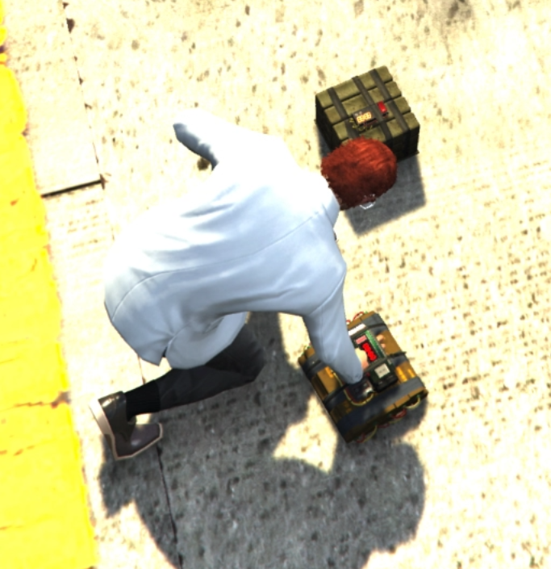

# Fun House (Yimmenu)

Some Yimmenu scripts I made (for research & fun purposes).

## Mods
### Freight
- Vehicle tab.
- Spawn a freight to drive on the street.

### AutoCounter
- Auto shoots flares countermeasure from any vehicle when missiles approach.

### Jet Cannon
- Auto bypasses the lazer/hydra cannon nerf from mercernaries dlc.

### CustomStickyBombs

- Self->Weapons tab.
- Replaces your sticky bombs with demolition charges from heists.
- Object model & explosion type configurable. 
- Would recommend Self->Weapons->Increase Sticky Limit to 50.

### WeaponAddons

- Self->Weapons tab.
- Fire Ammo: enable the fireammo cheat from SP.
- Gangsta Aim: enable gangsta aim with vanilla pistol (only).
- Anti-Vehicle Gun: shoot once to kill engine of any vehicle. (= context menu->killengine, but automatic)

### Wolverine
- Self tab.
- Regenerates x health/armour every k frames (x, k configurable).
- You appear as if spamming snacks rather than Godmode.

### UnlockWebsiteCars
- Vehicle tab.
- Unlocks website purchase of removed/unreleased cars.

### Reports
- Network->Reports tab.
- Show/clear player reports.

### (WIP) Thermal
- Self->Weapons tab
- Turn on/off thermal with E when aiming any gun (just like mk2 sniper). 
- Currently only works when you equip quad lens and turn it on first. If you know how to bypass MP thermal block pls lemme know.

## Credits & Reference
- [Yimmenu](https://github.com/YimMenu/YimMenu)
- [UnknownCheats (globals & locals)](https://www.unknowncheats.me/forum/grand-theft-auto-v/500059-globals-locals-discussion-read-page-1-a.html)
- [NativeDB](https://alloc8or.re/gta5/nativedb/)